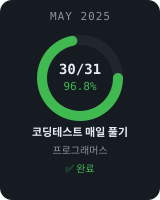

<table width="100%" border="0" cellspacing="0" cellpadding="12">
  <tr>
    <td width="100" align="center" valign="middle">
      
    </td>
    <td valign="middle">
      <h3>최이재 | Jenny Choi</h3>
      
      
      
    </td>
  </tr>
</table>

---

### 🛠 Tech Stack

---

### 💡 Self-Challenges

> 매월 중간 점검일에 업데이트합니다.

  
  &nbsp;&nbsp;
  

---

### 🗂 Projects

| 프로젝트 | 설명 | 기술 |
|---------|------|------|
| [🌐 LINGO BRIDGE](https://github.com/Jenny5789) | 다국어 지원 웹 번역 앱 | HTML · JS · MyMemory API |

---

### 📊 GitHub Stats

  
  &nbsp;
  

 

  
🌱 Keep Learning, Keep Growing

